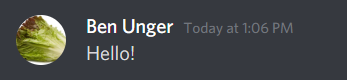
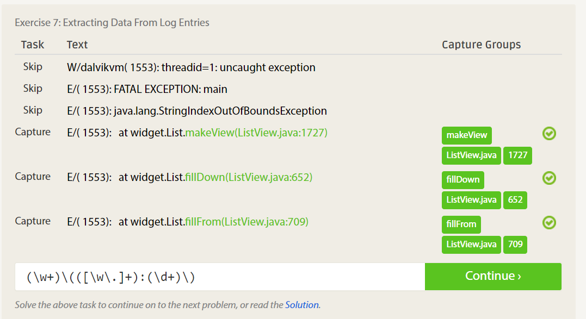

# Lab 01 Report - Introduction to Open Source Software

## Part 0
I have joined the Discord Server and sent a message.

Discord Screenshot:

## Part 1
I have forked the main repo, and have filled in my info to the index.md file in the main dir of the repo.

## Part 2
I have read the 10 criteria of Open Source Definition

I have read Eric Raymond's article Smart Questions - How to ask the question The Smart Way

Two more ways to answer a question:

-Don't assume the question asker knows the ins and outs of a language or library. You should provide reference in your answer

-Be available for follow up questions. Don't give an answer and then disappear if the question asker wants clarifications.

Response to Chapter 3 of Free Culture:

I thought it was interesting that the article focused on an RPI student, I can see why we picked it. When it comes to what Jesse actually did, of course he wasn't trying to distribute copyrighted music. RIAA and the MPAA have a long history of perusing their copyright way beyond what would be deemed normal. The fact that they went after someone who didn't even intend for people to use his search engine for music is absurd. It's another example of house wealthy people can use the judicial system ruin people, even if Jesse win the court case, his family would be bankrupt.

I have read the first chapter in Beautiful Code

## Part 3

I have WSL installed and working, and am familiar with unix commands

I have installed tree:

## Part 4
To show that I solved 7 of the RegexOne problems, here is the 7th problem completed (I needed to solve the past 6 to get to the 7th)

To show that I completed 4 of the crossword puzzles, here is the 4th beginner crossword puzzle.

## Part 5
I solved the blocky puzzle with this solution:

## Part 6
